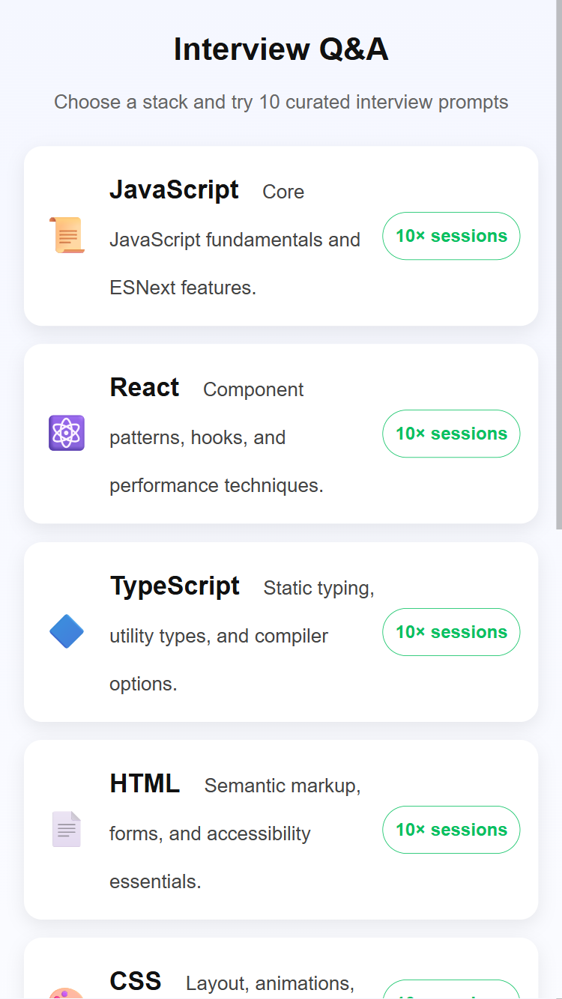
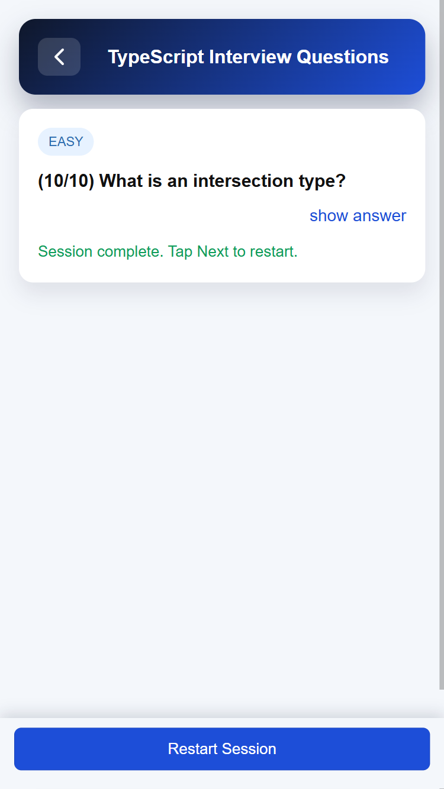
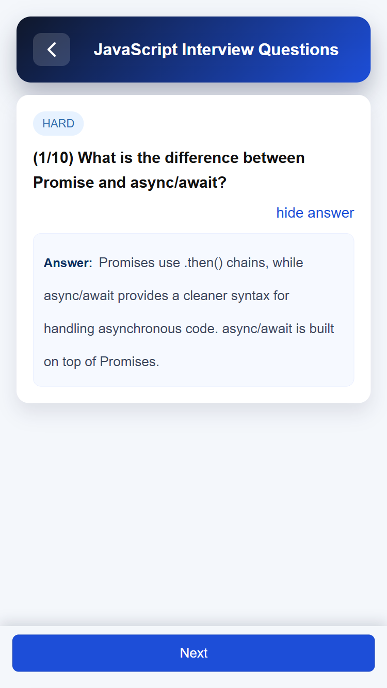

# QA App

[中文](./README.MD) | [English](./README_EN.MD)

一个基于 Taro（React）构建的 H5 应用(微信、支付宝小程序)，收集和整理了多种技术栈的面试题（JavaScript、React、TypeScript、HTML、CSS、Java、Go、Vue、Angular 等），方便快速刷题和复习。

本项目基于 SDD（Spec Driven Development，规格驱动开发）实践，由 AI 辅助实现。详细规格文档见 [`specs`](./specs)。

## 快速开始

- 前置条件
  - 建议使用 Node.js 18+
  - npm 9+

- 安装依赖
  - `npm install`

- 启动 H5 开发服务器
  - `npm run dev:h5`
  - 在控制台输出的地址中打开（默认：`http://localhost:10086`）

- 构建（可选）
  - `npm run build:h5`

## 界面预览

下面是主要页面的截图，图片保存在 `imgs/` 目录下：

- 技术栈选择页

  

- 题目答题页（问题视图）

  

- 题目答题页（显示答案）

  

## 使用说明

- 在首页选择一个技术栈，即可开始一轮包含 10 道随机题目的练习。
- 新的技术栈和题目数据位于 `src/data/*.json`，并通过 `src/utils/questionManager.ts` 和 `src/utils/constants.ts` 进行管理和绑定。

## 部署

Taro 支持多端构建。下面是常见平台的构建和发布方式：

- 微信小程序
  - 构建：`npm run build:weapp`
  - 使用微信开发者工具上传

- H5（Web）
  - 构建：`npm run build:h5`
  - 将 `dist` 目录部署到任意静态站点（如 Vercel、Netlify、Nginx 等）

- 支付宝小程序
  - 构建：`npm run build:alipay`
  - 使用支付宝开发者工具上传

- 字节跳动小程序
  - 构建：`npm run build:tt`
  - 使用字节跳动开发者工具上传

- 百度智能小程序
  - 构建：`npm run build:swan`
  - 使用百度开发者工具上传

### 小提示

- 在正式构建之前，建议始终使用对应平台的 `dev:*` 命令进行本地调试。
- 部署前请确认平台相关的 API 兼容性。
- 生产环境建议使用环境变量文件（如 `.env.production`）。
- `dist/` 目录中包含了目标平台的构建产物。

## 许可证

本项目基于 MIT License 开源发布。
